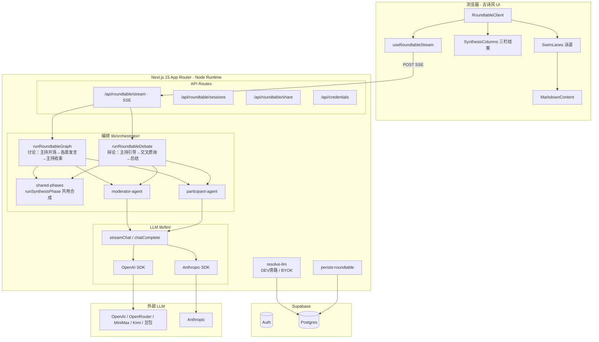

# 圆桌 Skill 云

多视角圆桌讨论产品：**每位列席是独立模型调用 + 本席 Skill**，主持单独一路；古诗风 UI；用户可在轮末 **席上插话**。**Skill 真源**为仓库内 `skills/<id>/SKILL.md`（YAML frontmatter + Markdown 正文），构建期写入 `.generated/skills-manifest.json`。

**栈**：Next.js 15（App Router）· Supabase（Auth / Postgres / RLS）· 用户 BYOK（多笔会）· SSE 流式编排。

## 架构概览



**数据流**：浏览器 `useRoundtableStream` → SSE POST → `runRoundtableGraph`（讨论）或 `runRoundtableDebate`（辩论）→ 各席逐一发言 → 主持收束 → `await_user` 或 `runSynthesisPhase` 合成结案 → token 实时 SSE 推送 → 泳道渲染 + Markdown / think 折叠。

## 主要页面与能力

| 路径                        | 说明                                                          |
| --------------------------- | ------------------------------------------------------------- |
| `/`                         | 序页、可试议题、可入席视角介绍                                |
| `/roundtable`               | 开席、左右分栏（设置 + 泳道）、席上插话、讨论/辩论模式切换    |
| `/roundtable/jiuxi`         | **旧席录**（登录）：历史会话列表、展卷、回到此席、撤席        |
| `/roundtable/jiuxi/[id]`    | 单条旧席详情（同上操作）                                      |
| `/roundtable/share/[token]` | **展卷**（公开只读）：同览泳道与结案提要，携卷复刻 / 同席重论 |
| `/settings`                 | **砚台**：笔会、授权、接口根地址、默认模型                    |
| `/credits`                  | **致谢**：Skill 来源索引与产品灵感致谢                        |
| `/login`                    | 登入（Supabase Auth）                                         |

查询参数：`/roundtable?resume=<uuid>` 载入旧席；`?fromShare=<token>` 携分享复刻；`?topic=&skills=id1,id2&maxRounds=n` 预填议题与列席。

## 内置视角 Skill（21 席）

| 视角           | skillId                       | 来源                                                                                  |
| -------------- | ----------------------------- | ------------------------------------------------------------------------------------- |
| 保罗·格雷厄姆  | `paul-graham-perspective`     | [alchaincyf/paul-graham-skill](https://github.com/alchaincyf/paul-graham-skill)       |
| 马斯克         | `elon-musk-perspective`       | [alchaincyf/elon-musk-skill](https://github.com/alchaincyf/elon-musk-skill)           |
| 乔布斯         | `steve-jobs-perspective`      | [alchaincyf/steve-jobs-skill](https://github.com/alchaincyf/steve-jobs-skill)         |
| 费曼           | `feynman-perspective`         | [alchaincyf/feynman-skill](https://github.com/alchaincyf/feynman-skill)               |
| 芒格           | `munger-perspective`          | [alchaincyf/munger-skill](https://github.com/alchaincyf/munger-skill)                 |
| 纳瓦尔         | `naval-perspective`           | [alchaincyf/naval-skill](https://github.com/alchaincyf/naval-skill)                   |
| 塔勒布         | `taleb-perspective`           | [alchaincyf/taleb-skill](https://github.com/alchaincyf/taleb-skill)                   |
| 特朗普         | `trump-perspective`           | [alchaincyf/trump-skill](https://github.com/alchaincyf/trump-skill)                   |
| MrBeast        | `mrbeast-perspective`         | [alchaincyf/mrbeast-skill](https://github.com/alchaincyf/mrbeast-skill)               |
| 卡帕西         | `andrej-karpathy-perspective` | [alchaincyf/karpathy-skill](https://github.com/alchaincyf/karpathy-skill)             |
| Ilya Sutskever | `ilya-sutskever-perspective`  | [alchaincyf/ilya-sutskever-skill](https://github.com/alchaincyf/ilya-sutskever-skill) |
| 张一鸣         | `zhang-yiming-perspective`    | [alchaincyf/zhang-yiming-skill](https://github.com/alchaincyf/zhang-yiming-skill)     |
| 张雪峰         | `zhangxuefeng-perspective`    | [alchaincyf/zhangxuefeng-skill](https://github.com/alchaincyf/zhangxuefeng-skill)     |
| 巴菲特         | `warren-buffett-perspective`  | [will2025btc/buffett-perspective](https://github.com/will2025btc/buffett-perspective) |
| 马克思         | `karl-marx-perspective`       | [baojiachen0214/karlmarx-skill](https://github.com/baojiachen0214/karlmarx-skill)     |
| 德鲁克         | `drucker-perspective`         | 自建（Powered by [nuwa-skill](https://github.com/alchaincyf/nuwa-skill)）             |
| 老子           | `laozi-perspective`           | 自建                                                                                  |
| 王阳明         | `wangyangming-perspective`    | 自建                                                                                  |
| 宫本茂         | `miyamoto-perspective`        | 自建                                                                                  |
| 道家           | `sage-perspective`            | 自建                                                                                  |
| 法家           | `legalist-perspective`        | 自建                                                                                  |

完整致谢与来源索引见 `[/credits](https://roundtable-skill-cloud.vercel.app/credits)`。Skill 索引参考 [awesome-persona-distill-skills](https://github.com/xixu-me/awesome-persona-distill-skills)。

## 目录约定

| 路径                          | 说明                                      |
| ----------------------------- | ----------------------------------------- |
| `app/`、`components/`         | 页面、布局、API Route、UI 组件            |
| `lib/`                        | 编排、LLM、schema、DB 访问、工具函数      |
| `skills/*/SKILL.md`           | Skill 源（frontmatter 须合法 YAML，见下） |
| `content/moderator.md`        | 主持人系统提示（讨论模式，运行时读取）    |
| `content/moderator-debate.md` | 主持人系统提示（辩论模式）                |
| `scripts/`                    | 构建脚本（如 manifest）                   |
| `tests/unit/`                 | Vitest 单测                               |
| `supabase/migrations/`        | 数据库迁移（按序号执行）                  |
| `docker/`                     | Docker 本地开发辅助配置（Kong 等）        |

根目录保留框架与工具链入口（`package.json`、`next.config.ts`、`middleware.ts`、`vitest.config.ts`、`eslint` / `prettier` 等）。

### Skill 文件格式

每个 `SKILL.md` 开头须为 **YAML frontmatter**（`---` 包裹），例如：

```yaml
---
name: my-skill-id
description: 一句话说明
---
```

正文为 Markdown；勿用 `## name:` 等标题冒充 frontmatter，否则 `pnpm build` 会失败。

## 文件命名

| 类别                 | 风格                                               | 示例                                   |
| -------------------- | -------------------------------------------------- | -------------------------------------- |
| React 组件（`.tsx`） | **PascalCase**，与默认导出名一致                   | `SwimLanes.tsx`                        |
| Hook（`.ts`）        | **kebab-case**，`use-foo-bar.ts`，导出 `useFooBar` | `use-roundtable-stream.ts`             |
| `lib/`、`tests/`     | **kebab-case**                                     | `resolve-llm.ts`                       |
| Next 路由            | 固定小写文件名                                     | `page.tsx`、`layout.tsx`、`route.ts`   |
| Skill 目录           | **kebab-case** + `SKILL.md`                        | `skills/legalist-perspective/SKILL.md` |

## UI 与渲染

- **Markdown 渲染**：`MarkdownContent` 组件（`react-markdown` + `remark-gfm`），支持 `<think>` 标签折叠显示。
- **结案提要**：`SynthesisColumns` 按 `##` 分节拆卡片，响应式三栏布局（xl:3 / sm:2 / 1）。
- **泳道**：`SwimLanes` 按主持 → 各席参与者 → 席上（你）排列；正在发言泳道有脉冲圆点与边框高亮。
- **左右分栏**：圆桌页 `RoundtableClient` 桌面端左栏（设置/操作 340px）+ 右栏（对话），移动端堆叠。
- **自动滚底**：流式输出时右栏自动平滑滚至底部（用户已在底部附近或有 live token 时触发）。

## 本地开发

### 方式一：直接运行（推荐快速迭代）

```bash
cp .env.example .env.local
# 至少填 DEV_LLM_API_KEY 即可本地跑通圆桌（无需 Supabase）
corepack enable   # 可选：锁定 pnpm 版本
pnpm install
pnpm dev
```

### 方式二：Docker Compose（含本地 Supabase）

全栈容器化，一键启动 Next.js + Supabase（Postgres / Auth / REST / Kong / Studio）。

```bash
cp .env.example .env.local
# 填写 DEV_LLM_API_KEY、JWT_SECRET、POSTGRES_PASSWORD 等

docker compose up --build
```

| 服务            | 地址                                             | 说明                     |
| --------------- | ------------------------------------------------ | ------------------------ |
| 应用            | [http://localhost:3000](http://localhost:3000)   | Next.js                  |
| Supabase API    | [http://localhost:8000](http://localhost:8000)   | Kong 网关（Auth + REST） |
| Supabase Studio | [http://localhost:54323](http://localhost:54323) | 数据库管理 UI            |
| Postgres        | localhost:54322                                  | 直连（用户 postgres）    |

> **注意**：Dockerfile 使用 Next.js standalone 输出模式，需在 `next.config.ts` 中添加 `output: "standalone"` 方可构建。本地直接 `pnpm dev` 不需要此配置。

### Supabase 与迁移

在 [Supabase](https://supabase.com) 建项目后（或使用 Docker 本地实例），**按顺序**在 SQL 编辑器执行：

1. `supabase/migrations/001_init.sql` — 会话、消息、凭据（含后续 BYOK 表结构基础）
2. `002_llm_providers.sql` — 多笔会、`user_llm_settings` 等
3. `003_roundtable_share_snapshots.sql` — 分享快照（仅服务端 `SUPABASE_SERVICE_ROLE_KEY` 写入）
4. `004_remove_jm_jiminai_providers.sql` — 清理弃用笔会
5. `005_roundtable_mode_and_atomic_persist.sql` — 会话 `mode` 持久化 + 原子写入整席 transcript

将 `NEXT_PUBLIC_SUPABASE_URL`、`NEXT_PUBLIC_SUPABASE_ANON_KEY` 写入 `.env.local`；生产需 `KEY_ENCRYPTION_SECRET`（加密 BYOK 密文）。分享链接绝对地址可选 `NEXT_PUBLIC_SITE_URL`；未设时由请求头推断。

**砚台**：选用笔会并保存授权；OpenAI 兼容类（OpenRouter、MiniMax、Kimi、豆包等）与 Anthropic 均已支持。

## 脚本与质量

| 命令                                                   | 作用                                                                         |
| ------------------------------------------------------ | ---------------------------------------------------------------------------- |
| `pnpm run build:skills`                                | 扫描 `skills/` 生成 manifest                                                 |
| `pnpm build`                                           | prebuild 自动生成 manifest 后 Next 生产构建                                  |
| `pnpm format` / `pnpm format:check`                    | Prettier                                                                     |
| `pnpm lint` / `pnpm lint:fix`                          | ESLint                                                                       |
| `pnpm check`                                           | `format:check` + `lint`                                                      |
| `pnpm test` / `pnpm test:watch` / `pnpm test:coverage` | Vitest；覆盖率统计主要为 `lib/**/*.ts`（门禁：行/语句/函数 ≥80%，分支 ≥75%） |
| `pnpm check:all`                                       | `format:check` + `lint` + `test:coverage`                                    |

提交时 **husky** + **lint-staged** 对暂存文件跑 Prettier 与 ESLint。建议安装 `.vscode/extensions.json` 中的推荐扩展。

## 编排与产品行为

- **双模式**：讨论（`runRoundtableGraph`）与辩论（`runRoundtableDebate`），共用 `runSynthesisPhase` 合成结案。
- **多代理逐席**：主持与每位列席各自 `stream` 调用；列席 system 仅含本席 Skill。
- **人可读席名**：`formatTranscript` 接受 `skillNames` 映射，LLM 上下文中使用中文名而非 skillId。
- **席上插话**：`await_user` 阶段用户可写入观点，记入 transcript（`role: user`），再「记入并续轮」时进入各代理上下文。
- **主持手记**：`summarizeModeratorMemory` 压缩轮末总结，服务端自动剥离 `<think>` 标签。
- **持久化**：每段流式编排 **finalize 后** 若已登录则以单个 DB 事务写入 `roundtable_sessions` / `roundtable_messages`（见 `lib/db/persist-roundtable.ts`）。
- **分享**：登录后可 `POST /api/roundtable/share` 生成 token；公开读 `GET /api/roundtable/share/[token]` 与展卷页；须配置 `SUPABASE_SERVICE_ROLE_KEY` 与 `003`、`005` 迁移。

## 致谢

- 产品灵感：[lijigang/ljg-roundtable](https://github.com/lijigang/ljg-skills/tree/master/skills/ljg-roundtable)
- Skill 蒸馏框架：[alchaincyf](https://github.com/alchaincyf)（花叔）— 13 个视角 Skill 及 [女娲造人](https://github.com/alchaincyf/nuwa-skill) 蒸馏工具
- Skill 索引：[awesome-persona-distill-skills](https://github.com/xixu-me/awesome-persona-distill-skills)

完整来源见 [致谢页](https://roundtable-skill-cloud.vercel.app/credits)。

## Vercel 部署

连接 Git 仓库，环境变量与 `.env.example` 对齐；`vercel.json` 已为流式 API 延长 `maxDuration`。部署前本地执行 `pnpm run build` 确认通过。
